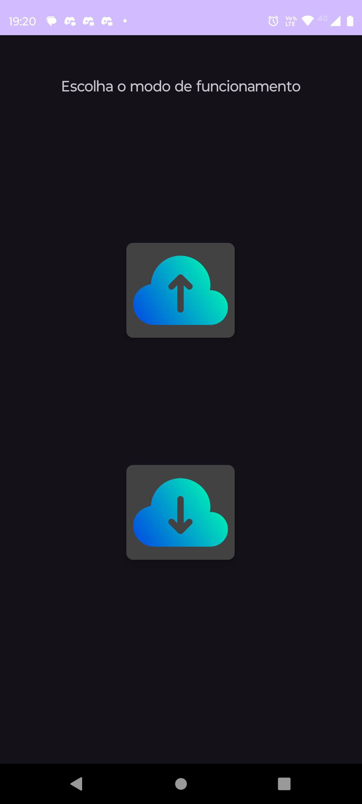
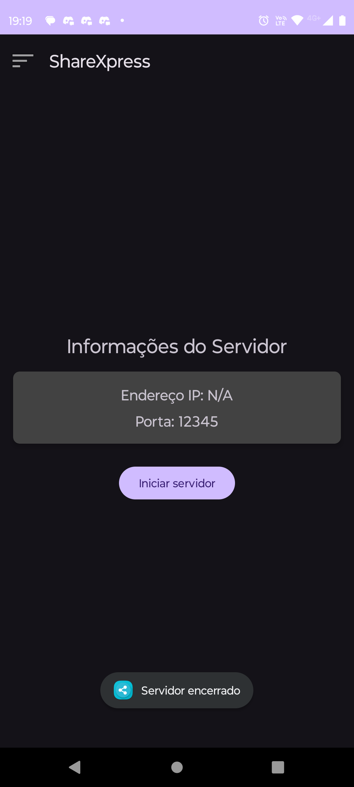
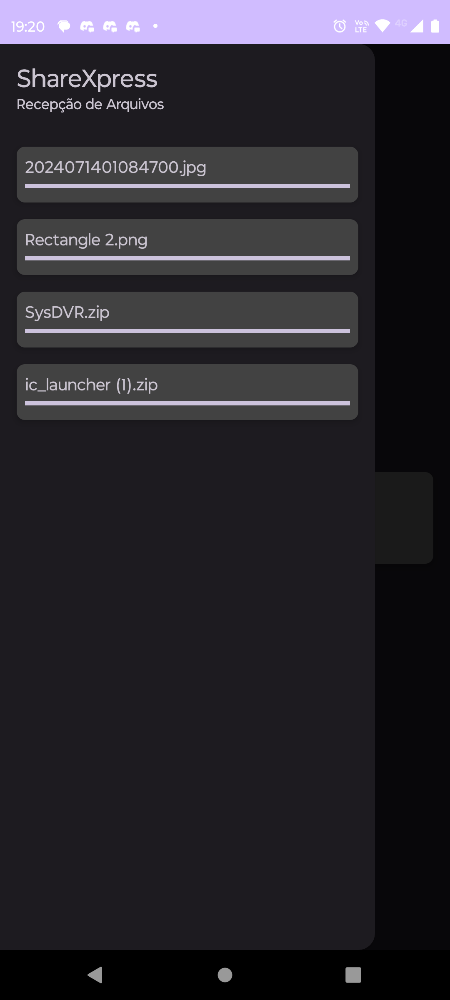
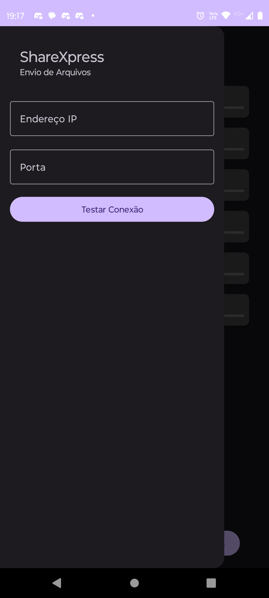

# ShareXpress_Android

ShareXpress é um aplicativo Android que permite a transferência de arquivos entre dispositivos Android e PCs sem a necessidade de MTP (Media Transfer Protocol). Esta versão para Android é um port da aplicação original desenvolvida em Python utilizando Qt5, oferecendo uma alternativa eficiente para o compartilhamento de arquivos.

## Funcionalidades

- **Transferência de Arquivos:** Envie arquivos do seu dispositivo Android para um PC e vice-versa.
- **Interface Amigável:** Visualize o progresso da transferência de arquivos com barras de progresso em tempo real.
- **Gerenciamento de Arquivos:** O aplicativo permite a seleção e envio de múltiplos arquivos, bem como a visualização dos arquivos recebidos.
- **Verificação de Espaço:** O aplicativo verifica o espaço disponível no dispositivo antes de iniciar a transferência.

## Requisitos

- **Android:** 6.0 (Marshmallow) ou superior
- **Permissões:** Acesso à leitura e escrita no armazenamento externo

## Instalação

1. **Clone o Repositório:**

   ```sh
   git clone https://github.com/seurepositorio/sharexpress-android.git
   ```
2. **Abra o Projeto:**

   - Abra o projeto no Android Studio.
3. **Configuração do Projeto:**

   - Certifique-se de que todas as dependências estejam corretamente configuradas.
4. **Compile e Execute:**

   - Conecte seu dispositivo Android ou inicie um emulador.
   - Compile e execute o projeto a partir do Android Studio.

## Como Usar

1. **Inicie o Servidor:**

   - Abra o aplicativo e inicie o servidor no menu principal.
2. **Envie Arquivos:**

   - Escolha os arquivos que deseja enviar e inicie a transferência.
3. **Receba Arquivos:**

   - Os arquivos enviados serão salvos no diretório de downloads do dispositivo.

## Funcionalidades Futuras

- **Suporte a Protocolos Adicionais:** Planejamos adicionar suporte a outros protocolos de transferência de arquivos.
- **Melhorias na Interface:** Melhorias contínuas na interface do usuário para uma experiência mais fluida.

## Imagens do Aplicativo











## Contribuindo

Se você gostaria de contribuir para o desenvolvimento do ShareXpress, sinta-se à vontade para abrir uma issue ou fazer um pull request.

## Licença

Este projeto está licenciado sob a [Licença MIT](LICENSE).

---

Sinta-se à vontade para ajustar qualquer seção conforme necessário para atender às especificidades do seu projeto!
